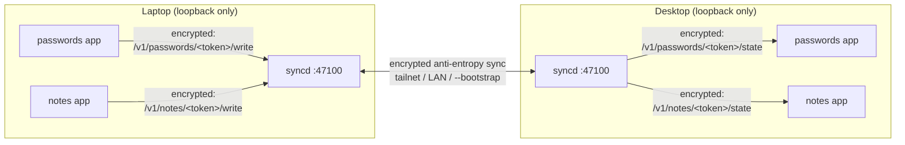

# syncd

syncd is a background daemon that keeps small pieces of application data — settings, bookmarks, credentials, notes, whatever an app wants synced — consistent across a person's own devices, with no server in the middle and no single device that has to be "the" authoritative one.

It runs once per machine. Any number of applications on that machine register with it (each under its own name and version token — see below) and get an independent, replicated dataset in return. syncd finds the same person's other devices (over a tailnet, a plain LAN, or an explicit address list), and keeps every registered application's data reconciled with its counterpart on each of them — continuously, in the background, without any of those applications needing to know how.

## How it works



- **One syncd, many applications.** Each application (identified by a name + token, see "Registering an application" below) gets its own independent CRDT dataset. Applications never see each other's data, and syncd doesn't interpret any of it — to syncd, a value is an opaque string.
- **No server, no leader.** Every syncd instance is identical; convergence comes from the CRDT merge rule (`src/core.rs`) plus a periodic anti-entropy loop, not from any device being authoritative. Two replicas that have seen the same ops always converge to the same state, regardless of the order those ops arrived in.
- **Local-first.** Reads and writes against your own syncd never block on the network — see `/v1/online` below — a device can go fully offline and keep working, then reconcile automatically once it's back.
- **Encrypted and authenticated, by secret, not certificate.** Every request and response for an application — local or peer-to-peer — is sealed with a key derived from a secret only that application's own devices know. See "Security model" below for exactly what this does and doesn't protect against.
- **Discovery, layered.** Peers are found via tailscale (if present), a LAN broadcast announce/listen, an explicit `--bootstrap` list, and peer exchange (PEX) — see "Discovery beyond the tailnet" further down.

## Installing syncd

Prebuilt binaries are published on [GitHub Releases](https://github.com/antoniopicone/serverless-sync/releases) for macOS (arm64), Linux (x86_64 and arm64), and Windows (x86_64) — no Rust toolchain needed. Every tag push triggers [.github/workflows/release.yml](.github/workflows/release.yml), which builds every target and attaches a checksummed archive per platform to that tag's release.

**macOS / Linux** — detects your OS and CPU, downloads the matching build, installs it, and registers it as a service (systemd on Linux, launchd on macOS):

```bash
curl -fsSL https://raw.githubusercontent.com/antoniopicone/serverless-sync/main/install/install.sh | sh
```

**Windows** (PowerShell) — same, registering a Scheduled Task that starts it at boot/logon and restarts it on failure:

```powershell
irm https://raw.githubusercontent.com/antoniopicone/serverless-sync/main/install/install.ps1 | iex
```

Both are safe to re-run — an existing syncd service is stopped and replaced, not duplicated — so the same command doubles as the upgrade path.

To pass options (`--device`, `--port`, `--bootstrap`, ...) rather than take the defaults, add them after `--`:

```bash
curl -fsSL .../install.sh | sh -s -- --device my-device --port 47100
```

PowerShell's piped `iex` can't take parameters, so download it first if you need them:

```powershell
iwr https://raw.githubusercontent.com/antoniopicone/serverless-sync/main/install/install.ps1 -OutFile install.ps1
./install.ps1 -Device my-device -Port 47100
```

Pass `--no-service` / `-NoService` to install just the binary without touching systemd/launchd/Task Scheduler. See `install/install.sh --help` for every flag, and `install/uninstall.sh` / `install/uninstall.ps1` to remove the service and binary again.

By default syncd listens on port **47100** and keeps every registered application's data under **`~/.syncd`** (a hidden folder in the installing user's home directory — override either with `--port` / `--data`).

## Registering an application

syncd runs once per machine, on one port, and hosts every application that wants to sync data through it side by side, without them interfering with each other.

Three things identify and protect an application:

- **name** — a short, stable identifier for the application itself, e.g. `passwords`.
- **token** — a string the application's own developer controls, bumped whenever a change would make old and new data incompatible (a schema change, a breaking format change). **This is namespacing, not a secret** — don't rely on it for access control, and don't treat it as something to keep hidden from the application's own users.
- **secret** — chosen once, out of band, by whoever pairs this application's devices (a random string, shared however the application's own UX wants — a QR code, manual entry, anything). **This is the actual secret.** Every device that will sync this application needs it; syncd only ever sees it during registration, on this one machine.

`(name, token)` selects which independent, replicated dataset a request is about; `secret` proves the caller is allowed to read or write it. Two installs of the same app with the same `(name, token)` *and* `secret` sync with each other; bumping the token starts a fresh, separate dataset; a caller with the wrong secret gets rejected the same way a forged request would.

Both `name` and `token` must be 1–64 characters of `[A-Za-z0-9_-]` — anything else is rejected with `400 Bad Request`. This keeps them safe to use both as a file name on disk (`~/.syncd/<name>.<token>.csv`) and as a URL path segment.

### Handshake (mandatory, local only)

```
POST /v1/register
{ "name": "passwords", "token": "9f86d081", "secret": "<your paired secret>" }

200 OK
{ "name": "passwords", "token": "9f86d081", "device_id": "laptop-1", "entries": 0, "vv": {} }
```

Unlike everything else below, this call is plain JSON, not an encrypted envelope — deriving the key from `secret` is the whole point of it, so there's nothing to encrypt with yet. That's only safe because **`/v1/register` only accepts loopback connections** (see "Security model"): the secret never has a reason to leave this machine.

Calling this **is** required, once per machine, before anything else about `(name, token)` works: syncd no longer creates applications on first contact the way it briefly did — without a secret there's no key to encrypt or verify with, so a peer trying to sync in an application this machine never registered locally gets `404`, not a silently-seeded empty dataset. Registering again with the *same* secret is an idempotent confirmation; with a *different* secret it's refused (`409 Conflict`) rather than silently re-keying an application other devices already paired against.

### Reading and writing

Every call below carries an **envelope** instead of its real payload — `{ "n": "<base64 nonce>", "ct": "<base64 ciphertext>" }` — sealed and opened with the key derived from `secret` (ChaCha20-Poly1305; see `src/crypto.rs`). The tables show the *plaintext* shape that travels inside the envelope.

| Method | Path | Plaintext body | Plaintext response |
|--------|------|------|---------|
| POST | `/v1/{name}/{token}/write` | `{ "entity": "key", "value": "..." }` (or `"value": null` to delete) | `{ "seq": u64, "vv": {...} }` |
| POST | `/v1/{name}/{token}/state` | `{}` | `{ "device", "entries": [{entity, value}, ...], "vv", "fingerprint", "online" }` |

`entity` is your application's own key — syncd doesn't interpret it, so an application can use flat keys, a JSON blob it serializes itself into the value, or anything else that fits in a string. Both endpoints work regardless of whether this node is currently "online" (see below), and both are **loopback-only**, same as `/v1/register`.

### What's host-level instead of per-application

A few endpoints describe the *machine*, not any one application, aren't namespaced under `(name, token)`, and carry no secret at all:

| Method | Path | Loopback-only? | Purpose |
|--------|------|-----------------|---------|
| GET  | `/v1/node` | No | This machine's identity (`device_id`, `hostname`, `port`) plus every registered application's `name`/`token`/entry count/**fingerprint** — a one-way hash, so this is safe to leave unauthenticated: it proves agreement between nodes without revealing what they hold |
| POST | `/v1/online` | Yes | `{ "online": bool }` — flips the peer-to-peer surface for *every* registered application at once, the same way a laptop's network connection doesn't go offline one app at a time |

A device only has one identity and one online/offline state, shared by whatever's registered on it — that's also why running several independent sync groups no longer means running several syncd processes on one machine: one install, any number of applications, each with its own secret.

The peer-to-peer wire protocol these endpoints (and the per-application ones above) sit on top of — the shapes another syncd, or a from-scratch client, actually speaks to reconcile state — is documented under "Integrating this layer into your own application" further down.

## Security model

**What's protected.** Every per-application request and response — local (write/state) or peer-to-peer (vv/ops/since/ops) — is an AEAD-sealed envelope (ChaCha20-Poly1305), keyed by SHA-256 of the application's `secret`. This gives confidentiality *and* authenticity in one step: there's no separate signature to check, because an envelope that opens successfully already proves the sender knew the secret, and one that doesn't (wrong secret, tampering, a forged request) is indistinguishable from noise and simply rejected (`401`). Two syncd instances — or a local client and its own syncd — that don't share a secret for a given `(name, token)` cannot read or write that dataset, even though the HTTP port itself is reachable to both.

**Why a shared secret instead of TLS.** There's no PKI here: no certificates to generate, distribute, or pin across devices whose addresses change. Whoever pairs an application's devices shares one secret between them, once; that pairing UX is entirely the application's concern, not syncd's. On top of that, tailnet traffic is already inside tailscale's own WireGuard tunnel — a second layer of transport encryption on top would mostly protect against LAN-only deployments, which is exactly what the per-application encryption above already covers uniformly, tailnet or not.

**Why `/v1/register`, `/v1/online`, and the write/state endpoints are loopback-only.** syncd's HTTP port binds `0.0.0.0` — it has to, that's how peers reach the sync endpoints — but nothing outside this machine should ever call these four. `/v1/register` carries a raw secret in the clear; the others are how *this machine's own* applications read and write their data. A middleware (`require_loopback` in `main.rs`) rejects any of the four from a non-loopback caller with `403`, regardless of which network interface the connection arrived on. Pass `--insecure-local-api` to turn this off — only for a deployment where "not loopback" doesn't mean "not trusted" (this repo's own Docker test rig, where the logger reaches nodes over an isolated bridge network — see docker-compose.yml). Don't pass it on a real install.

**What's *not* protected:**

- **The op log on disk is plaintext.** `~/.syncd/<name>.<token>.csv` holds decrypted values — the envelope protects data in transit, not at rest. If a dataset is genuinely sensitive (a password manager is the obvious case), the application itself should encrypt `value` before calling `/write` and decrypt it after `/state`; syncd never interprets `value`, so it will happily replicate ciphertext without ever seeing the plaintext.
- **`/v1/node` and `/v1/peers` are unauthenticated.** Anyone who can reach the port sees this machine's hostname, device ID, and every registered application's `name`/`token`/entry count/fingerprint — never the actual data (see the table above), but it is metadata. `token` leaking here doesn't grant access to anything, since it was never the secret.
- **No forward secrecy, no key rotation.** One secret, derived once, used for the life of the pairing. Rotating it means re-registering every device with a new one — there's no protocol for coordinating that rollover yet.
- **The secret is only as good as how it's shared.** syncd has no part in that exchange; a weak or leaked secret is exactly as bad as a weak or leaked password would be, because that's what it is.

## Discovery beyond the tailnet

A node doesn't need tailscale to be found: alongside `tailscale status --json`, every node also broadcasts a UDP announce on its local subnet and listens for the same from others (`discovery::lan_discovery_loop`, port 47188), merging whatever it hears into the same peer-exchange cache the tailnet path and PEX write into — so a LAN-only device shows up in the sync targets with no extra plumbing. `--advertise` (the address a node hands out to peers) falls back from an explicit flag, to the tailnet IP, to the machine's own LAN IP, and only to `127.0.0.1` if none of those resolve — so a peer without tailscale gets an address it can actually reach. Pass `--no-lan-discovery` to turn the broadcast off (e.g. on a network that filters it, or if you only want the tailnet-gated behavior below).

`--peer-prefix` filters which tailnet/LAN hostnames are even considered — without it, every node would probe *every* device it sees, on every round. In production the real filter is the roster of authorized devices, not the name; `--bootstrap host:port,...` is the precise alternative when you already know exactly who your peers are.

## Persistence

Every registered application keeps its state in its own CSV file (`~/.syncd/<name>.<token>.csv` by default — override the root with `--data`), plus a small sidecar `~/.syncd/<name>.<token>.key` holding the key derived from its secret at registration (mode `0600` on Unix) — that file is as sensitive as a password, since whoever reads it can decrypt and forge that application's traffic; it's what lets syncd resume an application across a restart without a local client re-supplying the secret every time (see "Security model" for what this key does and doesn't protect).

The file isn't a snapshot of "current values" — it's a **log of operations**: one row per change, in the order it happened (`device,seq,entity,kind,value,hlc`), appended as it's accepted, never rewritten. What you actually read and write against at runtime is a `BTreeMap` kept in memory (`entries` in `src/core.rs`) — that's the fast part, O(log n) per lookup/insert. The CSV only exists so that map isn't lost when the process restarts: on startup, syncd finds every `<name>.<token>.csv` already on disk and replays each through the same `apply()` used for sync, rebuilding that application's in-memory map from scratch — so a registered application keeps syncing across a restart even before the application itself makes another request.

So: disk = history (durable, human-readable, append-only), memory = current state (fast, disposable, rebuilt from disk on boot). This also means an op received from a peer is persisted exactly like a local one — durability doesn't depend on which device typed the value first.

One thing this doesn't do: compaction. The log only ever grows, so a very long-lived node would eventually pay an O(n) replay on every restart. It's not implemented here for a reason worth knowing — you can't just keep the latest row per entity and drop the rest, because a peer that's far behind still needs `/v1/{name}/{token}/ops/since` to answer with the *ops* it's missing, not just final values, and dropping history can leave gaps a stale peer can never fill in. Doing it correctly needs a snapshot format on top of the log, not just a shorter log.

## Where your application's data model plugs in

The insertion point for what actually gets synced is `src/core.rs`, and only that:

```rust
pub fn apply(&mut self, op: Op) -> bool     // the merge rule
pub fn local_change(&mut self, ...) -> Op   // user edit -> op
```

`discovery.rs` and `main.rs` don't know what an `Op` contains: to them, its payload is an opaque blob. `Replica` — one per registered `(name, token)` — is a generic last-writer-wins key/value store today; swapping in a different CRDT only changes these two functions and the payload shape, never the transport, the registry, or the discovery.

Two constraints to respect when you replace the reducer, or a node will silently diverge without telling you why:

- `apply` must stay **idempotent and commutative**. The same op applied twice, or ops applied out of order, must yield the same state. That's what lets the network layer skip guaranteeing either ordering or exactly-once delivery.
- the conflict tie-break must stay **deterministic**. The HLC includes the `device_id` for exactly this reason: two devices with the same timestamp must pick the same winner, or they diverge silently.

If you change `core.rs`, change the equivalent client-side reducer in parallel. They're the same rule written twice, and that's where divergence hides most easily. The fingerprint (`state_fingerprint()`) exists so you notice immediately: two aligned replicas always hash to the same value.

## Integrating this layer into your own application

syncd is really three independent pieces wired together in `main.rs`. Each one stands on its own:

- **`src/core.rs`** — the CRDT reducer: `Replica`, `Op`, `OpKind`, `VersionVector`, HLC-based deterministic conflict resolution. Self-contained; it has no dependency on HTTP, tailscale, the registry, or the key/value shape this demo happens to use.
- **`src/discovery.rs`** — peer discovery over a tailnet via `tailscale status --json`, a UDP broadcast announce/listen for plain-LAN peers, plus a bidirectional peer-exchange (PEX) cache. Entirely optional — swap it for whatever already tells your app where its peers are.
- **The wire protocol** — a handful of HTTP endpoints two replicas use to reconcile one application's state. Framework-agnostic: this demo happens to use axum, but the shapes below are plain JSON.

### 1. Bring in the reducer

Copy `core.rs` into your crate (or depend on it, if you split it into its own published crate) and rewrite the two functions where your actual data model lives — everything else in the module (version vectors, the op log, `ops_since`, `state_fingerprint`) keeps working unmodified, whatever `Op`'s payload turns out to hold:

```rust
pub fn apply(&mut self, op: Op) -> bool
pub fn local_change(&mut self, entity: &str, kind: OpKind, value: &str) -> Op
```

Keep the two invariants from the section above — idempotent/commutative merge, deterministic tie-break — and you're done with this part.

### 2. Expose the sync endpoints, per application

Two replicas reconcile by speaking three small endpoints, namespaced under the `(name, token)` of the application they're reconciling — see "Registering an application" above for what those mean, and "Security model" for the envelope every body/response below is actually wrapped in (`crypto::seal`/`crypto::open`, keyed by that application's secret — the shapes here are the *plaintext* carried inside). Add them to whatever HTTP server your app already runs — axum, actix-web, warp, a bare `TcpListener`, it doesn't matter — only the shapes matter:

| Method | Path | Plaintext body | Plaintext response |
|--------|------|------|---------|
| POST   | `/v1/{name}/{token}/vv`         | `{}`                          | your `VersionVector`                                            |
| POST   | `/v1/{name}/{token}/ops/since`  | `{ "vv": VersionVector }`     | `{ "ops": [Op, ...] }` — ops you have that the caller is missing |
| POST   | `/v1/{name}/{token}/ops`        | `{ "ops": [Op, ...] }`        | `{ "applied": usize, "vv": VersionVector }`                     |

`/v1/peers` (`{ "peers": [Peer, ...] }` → the union of what you both know) is separate: host-level, unencrypted, and PEX-only — skip it if you already have your own discovery. If you skip encryption entirely for your own reimplementation (e.g. an internal-only deployment), a peer expecting sealed envelopes simply won't be able to open what you send — there's no unencrypted fallback mode.

### 3. Drive it with a periodic sync round

`sync_round()` in `main.rs` is the whole algorithm for one application, end to end: pull what the peer has that you don't (`/v1/{name}/{token}/ops/since`), push what you have that the peer doesn't (`/v1/{name}/{token}/ops`) — sealing every request and opening every response with that application's key as it goes. It's about sixty lines and touches nothing from `core`/`discovery` beyond the `Op` type — copy it as-is and point it at whichever HTTP client your app already uses. Peer exchange (`exchange_peers()`) is separate, host-level, and unencrypted: run it once per peer per tick, not once per application.

Spawn it on a timer (`tokio::spawn` plus `sleep` in this demo) against your list of known peer addresses, once per locally-registered application. Where those addresses come from is entirely up to you:

- keep `discovery.rs` as-is if a tailnet and/or a plain LAN (via its UDP broadcast) already covers where your peers are;
- swap it for mDNS/DNS-SD if you need LAN discovery across subnets broadcast can't reach;
- swap it for a static list from config, or a call into whatever service registry you already run (Kubernetes, Consul, anything).

The reducer and the sync protocol neither know nor care — they only ever see a `Vec<String>` of `host:port` targets.

### 4. Optional: a local-first "offline" toggle

The pattern the test rig's UI demonstrates — a device stays fully usable, reads and writes never block, while only its peer-to-peer surface is turned off — is just: gate the sync endpoints above (and any discovery probe) behind a flag, and never gate your own read/write endpoints on it. It's host-level, not per-application — see `guard_online` in `main.rs` for the ten-line version.

That's the entire surface. Nothing in `core.rs` or the wire protocol assumes axum, tailscale, the registry, or even Rust on both ends — a peer can be any language that speaks the same JSON endpoints.

## The Docker Compose test rig

Everything above is exercised end-to-end by a small Docker Compose rig in this repo: three syncd nodes, sharing one demo application (`demo`/`v1`, see `docker-compose.yml`), plus a fourth container — the logger — that watches all three from outside the sync path and renders a live dashboard. It's how the claims above ("no leader", "reconverges automatically", "the logger isn't a dependency") get checked instead of just asserted.

```
docker-compose.yml     3 nodes + logger
Dockerfile              single image, two binaries
docker/entrypoint.sh    starts tailscaled if a TS_AUTHKEY is set
scenario.sh             test sequence with automatic assertions
```

No addresses are configured between the three nodes — they find each other with no `--bootstrap` at all, the same way any two real devices would. **`TS_AUTHKEY` is optional** (see `env.example`): set it and the three join your real tailnet and find each other by querying `tailscaled`, exactly as described above; leave it unset and `docker/entrypoint.sh` skips tailscale entirely, falling back to the LAN broadcast discovery from "Discovery beyond the tailnet" over the compose file's own bridge network — no tailscale account needed for a quick local run.

### Start

```bash
docker compose up -d --build     # no tailnet: nodes find each other over the bridge network
open http://localhost:9000
```

To run it on your real tailnet instead, `cp env.example .env`, uncomment `TS_AUTHKEY` and fill in a key generated from the Admin console (Settings → Keys) as **Reusable** (three containers share it) and **Ephemeral** (nodes disappear from the tailnet when you stop the compose stack, instead of piling up), then `docker compose up -d --build` the same way.

Ports: `47101`, `47102`, `47103` for the three devices, `9000` for the logger.

```bash
./scenario.sh    # exits non-zero if a phase fails
```

### What you see at :9000

Each card is one device you can act on directly: edit its key/value entries inline, add or delete a key, and flip it offline with the switch. Offline doesn't mean disconnected from the UI — it means the device keeps reading and writing locally while its peer-to-peer sync simply stops, so you can watch it diverge, then flip it back online and watch it reconverge on its own, no manual reconciliation.

The banner at the top is the **fingerprint**: a hash of the replicated state. If it matches across all nodes the replicas are aligned; if it stays different, the merge has diverged and the problem is in the CRDT, not the network. Below the cards, a live event feed scrolls: `op.local`, `sync.ok`, `peer.unreachable`, `node.online`/`node.offline`.

Green requires **every** node to respond and agree. The nuance matters: if a node is suspended and you only look at the ones still alive, the remaining two agree with each other and the banner would go green in the middle of a partition — a convergence that isn't real. A node that doesn't answer is an unknown state, not an agreeing one. The `live_aligned` field in `/api/state` reports separately whether the reachable subset is at least internally consistent.

### Why `--accept-dns=false`

Without it, `tailscaled` rewrites `/etc/resolv.conf` toward MagicDNS and the container stops resolving Docker-network names: nodes would no longer find `logger`. Discovery doesn't need it anyway, since it reads the `100.x` addresses straight out of `tailscale status --json`.

### The logger is not in the sync path

It has no `TS_AUTHKEY`, doesn't join the tailnet, isn't a peer. It receives pushed events from the nodes (fire-and-forget, short timeout, every error ignored) and polls each node's encrypted `/v1/demo/v1/state` and write endpoints over the Docker network — which it can only do because it holds the demo application's secret (`SERVICE_SECRET`, registered on all three nodes at its own startup) and because the nodes run with `--insecure-local-api` (see "Security model"): loopback-only would otherwise refuse a container reaching in over the Docker bridge.

I ruled out the two alternatives for a specific reason. A fourth peer that quietly syncs would see the ops but not the exchanges between the other three. A proxy sitting in the traffic path would introduce exactly the central point this architecture denies, and would skew the timings you're trying to measure.

Phase 5 of the scenario turns the logger off, writes to a node, and checks that the three still converge. An observer that becomes a dependency is a bug in the observer.

## What this rig doesn't prove

It doesn't test the iOS client, which needs to run against a real node (see the PoC's own README). It doesn't test what happens with a wrong or leaked secret across real devices (see "Security model" for what that would and wouldn't expose), only that a mismatched secret fails to decrypt in isolation. And it doesn't test compaction, because in a test session the op log never grows long enough to become a problem.
