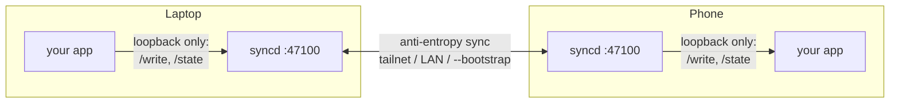

# syncd

## What it is

syncd is a small background daemon that keeps one dataset — settings, a reading list, a password vault, anything small — consistent across a person's own devices. No server in the middle, no device that has to be "the" authoritative one, no cloud account.

**This repo is a foundation, not a product.** You don't install this exact binary — you fork it: copy `core.rs` and `discovery.rs` into your own application's daemon, adapt `main.rs`/`persist.rs` to your data model, and you have a working sync daemon in an afternoon. The `syncd`/`logger` binaries built from this repo host a generic key/value dataset purely so the pattern can be demonstrated and tested without inventing a throwaway data model just for that — see "How to test" below.

Full reference (every flag, the wire protocol, persistence internals, discovery, security notes, and the step-by-step fork recipe) lives in **[DOCUMENTATION.md](DOCUMENTATION.md)**.

## Motivation

Most "sync your app's data across devices" solutions mean standing up a server, a database, and an account system — for a laptop and a phone that are, in practice, usually a few meters apart on the same network. syncd exists for the smaller case: an application that just needs its own data to agree across a person's own devices, with no third party in the middle, no subscription, and nothing to run except the daemon itself next to each app.

It's a foundation rather than a library because the shape that keeps recurring across real uses (a password manager, a browser extension) isn't "import a sync function" — it's "a small background process, a loopback API for the app it serves, a peer-to-peer API for its siblings on other devices." Forking a small, well-understood codebase and adapting the few pieces that are actually application-specific has been faster and easier to reason about than parameterizing one generic library to cover every case up front.

## Architecture



- **One process, one dataset.** No registry, no multi-tenancy: `syncd` owns exactly one CRDT dataset and one CSV log. Several independent datasets on one machine means several copies of your fork running side by side.
- **No server, no leader.** Every instance is identical; convergence comes from a CRDT merge rule plus a periodic anti-entropy loop, not from any device being authoritative. Two replicas that have seen the same operations always converge to the same state, regardless of arrival order.
- **Local vs. peer-to-peer, split at the port.** `/write` and `/state` (what your app calls) only accept loopback connections. The peer-to-peer endpoints (what another device's syncd calls) listen on every interface, because they have to.
- **Local-first.** A device can be flipped offline (`/v1/online`) or genuinely lose its connection and keep reading and writing the whole time — it diverges from its peers, then reconverges automatically, with no manual reconciliation, once it's back.
- **Discovery, layered.** Peers are found via tailscale (if present), a LAN broadcast announce/listen, an explicit `--bootstrap` list, and peer exchange — no address needs to be configured by hand in the common case.

Details on every endpoint, flag, and internal — [DOCUMENTATION.md](DOCUMENTATION.md).

## How to test (with Docker Compose)

A small rig exercises the pattern end to end: three `syncd` nodes running this repo's own demo dataset, plus a `logger` container that watches all three from outside the sync path and renders a live dashboard.

```bash
docker compose up -d --build
open http://localhost:9000
./scenario.sh    # exits non-zero if a phase fails
```

No tailscale account needed for this: `TS_AUTHKEY` is optional (see `env.example`) — set it to have the three nodes join your real tailnet, or leave it unset and they'll find each other over the compose file's own Docker network instead.

At `http://localhost:9000`, each card is one device. Edit its entries directly, or flip it **offline** with the switch to watch it keep working locally while diverging from the others, then flip it back on and watch it reconverge with no manual reconciliation — that switch is a real, two-way partition of the sync surface (`/v1/online` on the node itself), not a UI-only simulation. `scenario.sh` additionally pauses/unpauses a whole container to test a harder failure (the process itself gone, not just its network), and checks that the remaining nodes correctly flag the gap instead of quietly agreeing with each other.

The banner at the top is the **fingerprint**: it matches across all nodes when replicas are aligned, and requires *every* node to respond, not just the ones still answering — see [DOCUMENTATION.md](DOCUMENTATION.md#the-docker-compose-demo) for why that distinction matters and what the rig actually proves.
